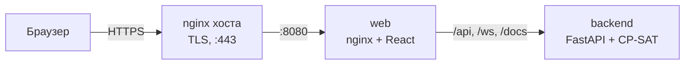
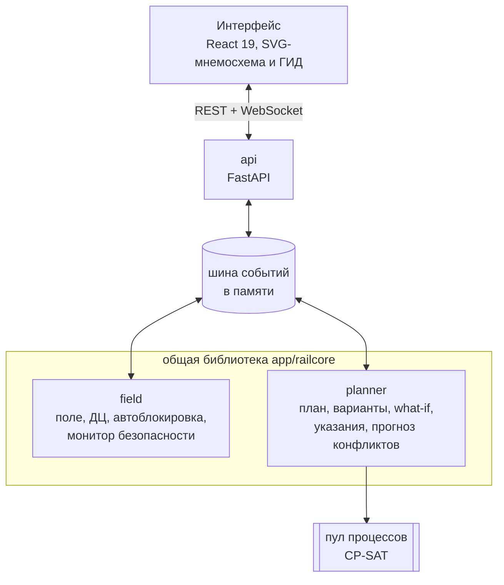

# Автодиспетчер

**Система поддержки решений поездного диспетчера однопутного участка.** Держит бесконфликтный план движения, при сбое
за секунды предлагает три варианта с цифрами последствий и объяснением на русском, позволяет проверить «что будет,
если…», даёт машинисту рекомендованный профиль скорости и эмулирует диспетчерскую централизацию (ДЦ) с автоблокировкой.

> Прототип для хакатона РЖД. Система консультативная: порядок движения меняет только диспетчер, команды идут через ДЦ и
> СЦБ, которые остаются последней инстанцией. Не заменяет СЦБ, АЛСН/АЛС-ЕН и сертифицированные системы. Данные вымышленные.

**Коротко в цифрах** (замеры, не оценки — [docs/pitch-numbers.md](docs/pitch-numbers.md)):

| | |
|---|---|
| От сбоя до трёх вариантов | **0,3 с** медиана, **≤ 3,6 с** в 95% случаев |
| Опоздания против работы без системы | **−44%** взвешенных, **−74 мин** за смену 8,5 ч |
| Энергия тяги при автоведении | **−29%** у поездов с запасом времени |
| Нарушений безопасности | **0** на 180 прогонах (1 530 ч симуляции) |

---

## Содержание

1. [Что умеет](#что-умеет)
2. [Быстрый старт](#быстрый-старт)
3. [Деплой на сервер](#деплой-на-сервер)
4. [Как показать](#как-показать)
5. [Как это устроено](#как-это-устроено)
6. [API](#api)
7. [Проверки и тесты](#проверки-и-тесты)
8. [Документация](#документация)
9. [Структура репозитория](#структура-репозитория)
10. [Ограничения прототипа](#ограничения-прототипа)

---

## Что умеет

- **Бесконфликтный план.** CP-SAT (OR-Tools) решает, кто где скрещивается и обгоняется, на какой путь станции встаёт
  и когда отправляется, — с правилами двусторонней автоблокировки, межпоездным и станционными интервалами (τск, τнп)
  и полезной длиной путей.
- **Варианты при сбое.** Препятствие (скот), неисправность поезда, окно (закрытие перегона), предупреждение
  (ограничение скорости), опоздание поезда, отказ выходного светофора. Три карточки: «Минимум задержек», «Устойчивый
  план» (ремонт займёт максимум), «Приоритет пассажирских» или «Вспомогательный локомотив». На каждой — опоздания по
  поездам, индекс, строка «если сбой затянется», объяснение. Одна помечена «рекомендуем».
- **Живые карточки.** Пока диспетчер думает, карточки пересчитываются от «сейчас» каждую секунду, время идёт ×1;
  ставший неисполнимым вариант уходит в «устарел», система сама предлагает новые.
- **Указания на графике (ГИД).** Перетащить прибытие или отправление поезда: границы, мгновенный прогноз, как это
  разойдётся по другим поездам, и два варианта — «Сохранить порядок» и «Переразвести». Указание держится во всех
  пересчётах, пока его не снимут.
- **What-if.** «2003 идёт 60 км/ч», «ремонт 40 мин» — прогноз поверх действующего плана, не трогая его;
  «Перенести в работу».
- **Автоведение (Connected DAS).** Профиль скорости под утверждённый план: если поезд всё равно будет ждать
  скрещения, он не мчится и не стоит, а приходит к моменту освобождения пути — на выбеге.
- **Эмуляция ДЦ и поля.** Блок-участки, проходные светофоры, установленное направление перегона, маршруты по плану,
  монитор безопасности (счётчик нарушений — всегда 0).
- **Индекс качества движения** 0–100 из пяти факторов, прогноз конфликтов, журнал решений, перемотка, CSV-отчёт,
  сценарии учений (в том числе «8 сбоев разом»).

---

## Быстрый старт

### Docker (одна команда)

Нужны Docker и Docker Compose (Docker Desktop, OrbStack или Docker Engine).

```bash
git clone git@github.com:Mayntu/auto-dispatcher.git && cd auto-dispatcher
cp .env.example .env              # порты и логины интерфейса — по желанию поменять
docker compose up -d --build      # первая сборка — несколько минут
```

Откройте **http://localhost:8080**. Swagger — **http://localhost:8080/docs**.

```bash
docker compose ps                 # оба контейнера должны быть Up (backend — healthy)
docker compose logs -f backend    # логи планировщика и поля
docker compose down               # остановить
```

### Без Docker (разработка)

```bash
# бэкенд (Python 3.12, uv)
uv venv --python 3.12 .venv
uv pip install --python .venv/bin/python -e ".[dev]"
.venv/bin/python -m app.all                 # http://localhost:8000 (API, /docs)

# интерфейс (Node 22)
cd web && npm install
cp .env.example .env && sed -i '' 's/^VITE_DATA_SOURCE=.*/VITE_DATA_SOURCE=live/' .env   # Linux: sed -i без ''
npm run dev                                 # http://localhost:5173, /api и /ws проксируются на :8000
```

Без `VITE_DATA_SOURCE=live` интерфейс работает на своём встроенном демо-движке без сервера (см. `web/README.md`).

### Учётные записи

Логины и пароли — в `.env` (`VITE_*_LOGIN`, `VITE_*_PASSWORD`). Они встраиваются в сборку интерфейса, поэтому после
изменения — `docker compose up -d --build web`.

| Роль | Что делает |
|---|---|
| Диспетчер | видит участок, выбирает и применяет варианты, what-if, указания на ГИД, автоведение, журнал |
| Инструктор | создаёт нештатные ситуации, уточняет их длительность, управляет временем симуляции |
| Администратор | всё, что диспетчер, плюс веса и пороги индекса, приоритеты, параметры решателя |

Удобно открыть две вкладки: инструктор и диспетчер, они синхронизируются.

---

## Деплой на сервер

Схема: интернет → **nginx хоста** (HTTPS) → контейнер **web** (nginx: интерфейс, прокси `/api`, `/ws`, `/docs`)
→ контейнер **backend** (`python -m app.all`).



**1. Сервер.** Linux с Docker Engine и плагином compose. Ресурсы: 4 vCPU, 4 ГБ RAM — комфортно (CP-SAT решает три
стратегии параллельно в отдельных процессах; на 2 vCPU варианты считаются, но могут выходить за 5 с).

**2. Код и настройки.**
```bash
git clone git@github.com:Mayntu/auto-dispatcher.git /opt/autodispatcher && cd /opt/autodispatcher
cp .env.example .env
nano .env        # обязательно поменять пароли VITE_*_PASSWORD; WEB_PORT=8080 оставить
```

**3. Запуск.**
```bash
docker compose up -d --build
curl -s localhost:8080/health      # {"ok":true,"sim_time":...}
```
Порт API (`API_PORT`, 8000) открыт только на `127.0.0.1` — для отладки; наружу торчит только `WEB_PORT`.

**4. HTTPS и домен** (nginx хоста, сертификаты — свои):
```bash
sudo cp deploy/nginx/autodispatcher.conf /etc/nginx/sites-available/autodispatcher.conf
sudo sed -i 's/DOMAIN/your.domain.ru/g' /etc/nginx/sites-available/autodispatcher.conf
# /etc/nginx/snippets/your.domain.ru.conf: ssl_certificate ...; ssl_certificate_key ...;  (например, от certbot)
sudo ln -sf /etc/nginx/sites-available/autodispatcher.conf /etc/nginx/sites-enabled/
sudo nginx -t && sudo systemctl reload nginx
```
Конфиг уже проксирует WebSocket (`/ws`, таймаут 1 ч) и ставит заголовки безопасности.

**5. Обновление.**
```bash
cd /opt/autodispatcher && git pull && docker compose up -d --build
```

**Переменные `.env`:**

| Переменная | По умолчанию | Что это |
|---|---|---|
| `WEB_PORT` | 8080 | порт интерфейса на хосте |
| `API_PORT` | 8000 | порт API на `127.0.0.1` (отладка) |
| `SIM_EPOCH` | `2026-10-02T07:55:00+05:00` | момент «ноль» часов симуляции |
| `LOG_LEVEL` | INFO | уровень логов бэкенда |
| `VITE_DISPATCHER_LOGIN` / `_PASSWORD` | dispatcher / change-me | вход диспетчера |
| `VITE_INSTRUCTOR_LOGIN` / `_PASSWORD` | instructor / change-me-three | вход инструктора |
| `VITE_ADMIN_LOGIN` / `_PASSWORD` | admin / change-me-too | вход администратора |

**Важно знать:** состояние (план, журнал, история перемотки) живёт в памяти бэкенда — перезапуск контейнера
начинает симуляцию заново с 07:55. Базы данных в прототипе нет. Нормативный график — на 48 часов симуляции
(на ×60 это меньше часа): когда он заканчивается, симуляция сама начинается заново; вручную — кнопкой инструктора
«Начать учение заново».

---

## Как показать

Сценарий защиты, проверенный замерами ([docs/pitch-numbers.md](docs/pitch-numbers.md), раздел D):

1. **Штатное движение** (×20): мнемосхема и ГИД, индекс «Норма» ~100, нарушений безопасности 0.
2. **Скот на перегоне Рзд. 1 — Степная** — ставить **около 08:15** по часам симуляции (в 08:00 он ещё никого не
   задевает): индекс падает до ~74, через 1–4 с — три карточки. Наведение — «призрак» плана на ГИД; «Применить».
3. **Неисправность грузового 2001** на подъёме Степная — Рзд. 2 (он заходит туда через ~34 мин после старта):
   «ждать ремонт» дешевле при ожидаемой длительности, «вспомогательный локомотив» страхует от затянувшегося ремонта.
4. **What-if:** 2003 → 60 км/ч — как изменятся скрещения.
5. **Автоведение:** пассажирский **341** на Рзд. 1 — Степная — накат перед станцией, экономия ~62% энергии.
6. **8 сбоев разом:** сценарий «Массовые сбои» — интерфейс не тормозит, варианты по всем восьми за ~4 с.
7. **Указание на ГИД:** перетащить отправление поезда — прогноз мгновенно, два варианта, указание держится.

На демо машину ничем не нагружать: под параллельной нагрузкой пересчёт может выйти за 5 с.

---

## Как это устроено



Все сервисы — в одном процессе (`python -m app.all`), общаются через шину событий за интерфейсом `EventBus`
(в демо — в памяти). Тяжёлый расчёт — в отдельных процессах, event loop не блокируется.

**Участок** (вымышленный): 6 раздельных пунктов (4 станции, 2 разъезда), 5 **однопутных** перегонов на 84 км,
трёхзначная двусторонняя автоблокировка — 33 блок-участка, 80 светофоров. Подъём 8‰ на Степная — Рзд. 2 режет
грузовой до ~48 км/ч. Нормативный график — 56 поездов в сутки (скорые, пассажирские, грузовые), непрерывно на 48 ч.

**Как думает планировщик.**
- *Модель* — CP-SAT от «сейчас» на горизонт 2 ч (8–9 поездов, ~400 переменных): для каждого поезда и пункта
  прибытие, отправление, остановка и путь станции. Встречные на перегоне не пересекаются (плюс τск и смена
  направления), попутные идут пакетом с межпоездным интервалом, на разъездах — τнп, путь станции — по полезной
  длине и платформам. Цель — взвешенные опоздания (скорый 5, пассажирский 3, грузовой 1), лишние остановки,
  долгие ожидания.
- *Тёплый старт и запасной путь* — быстрая оценка фиксированного порядка («альтернативный граф», длиннейший путь
  в графе событий) даёт подсказку решателю и план, если тот не успел за 3,5 с.
- *Три стратегии параллельно*, единое мерило для «рекомендуем», устойчивость при максимальной длительности сбоя.
- *Времена хода* — тяговый расчёт: сопротивление `a + b·v + c·v²`, уклоны, тяга `min(F_пуск, P/v)`, торможение.

**Индекс качества движения** `I = 100·Σwᵢsᵢ`: расписание 0,30, пропускная способность 0,20, энергия 0,15,
конфликты 0,20, точность прибытия 0,15; «Норма» ≥ 80, «Внимание» ≥ 60. Меняется в настройках без перезапуска.

Полная спецификация и журнал всех решений — [CLAUDE.md](CLAUDE.md).

---

## API

Полный список с примерами — Swagger: `/docs`. Основное:

| Метод | Путь | Что |
|---|---|---|
| GET | `/api/state` | снимок: поле, план, варианты, индекс, журнал, конфликты |
| WS | `/ws` | снимок при подключении, дальше поток событий (`field.state` 2 Гц, `planner.variants`, `kpi.index`, …) |
| POST | `/api/incidents` | создать сбой (6 типов) → варианты по WS |
| POST | `/api/incidents/{id}/estimate`, `/resolve` | уточнить длительность / снять |
| POST | `/api/plan/apply`, `/api/plan/variants/{id}/reject` | применить / отклонить вариант (409 — устарел) |
| POST | `/api/whatif`, `/api/whatif/{id}/promote` | what-if и «перенести в работу» |
| GET/POST/DELETE | `/api/plan/manual/*`, `/api/plan/pins` | указания на ГИД: границы, прогноз, варианты, снятие |
| GET | `/api/ato/{train_id}` | профиль автоведения |
| POST | `/api/dc/direction`, `/api/sim/clock` | смена направления перегона, пауза/скорость |
| POST | `/api/sim/reset` | начать симуляцию заново с 07:55 (кнопка инструктора «Начать учение заново») |
| GET/POST | `/api/scenarios`, `/api/scenarios/{id}/run` | сценарии учений |
| GET/PUT | `/api/settings` | веса и пороги индекса, приоритеты, интервалы |
| GET | `/api/history/frames`, `/history/events`, `/api/reports?format=csv` | перемотка, журнал, отчёт |

Формат полей для интерфейса — [docs/frontend-contract.md](docs/frontend-contract.md).

---

## Проверки и тесты

```bash
.venv/bin/python -m pytest -q                       # 46 тестов: физика, модель, АБ, указания, сбои, API
bash tools/verify.sh                                # всё разом (~10 мин): pytest, аудит, стресс, живой сценарий
```

| Инструмент | Что проверяет |
|---|---|
| `tools/audit.py` | независимый проверяльщик правил на каждом плане + сравнение CP-SAT с «ничего не делать» и FIFO |
| `tools/stress.py` | сотни сценариев без экрана: случайные сбои × 5 стилей поведения диспетчера, указания на ГИД, массовые сбои; ловит нарушения безопасности, зависания, обманутые обещания карточек (`--json` — выгрузка) |
| `tools/e2e_dispatcher.py --base URL` | живой сценарий диспетчера через API и WebSocket (56 проверок) |
| `tools/e2e_manual.py --base URL` | указания на ГИД: границы → прогноз → варианты → применение → сбой → снятие |
| `tools/e2e_contract.py --base URL` | эндпоинты интерфейса: оценка сбоя, what-if, настройки, сценарии, история, отчёт |
| `tools/explain_case.py --incident cow --at 08:40` | разбор одной ситуации человеческим языком |
| `tools/pitch_numbers.py`, `tools/pitch_report.py` | замеры для питча → `docs/pitch-numbers.*` |
| `tools/gen_infra.py`, `tools/gen_timetable.py` | генерация `data/infra.json` и нормативного графика (CP-SAT, ~4 мин) |

Живые проверки можно запускать и против Docker: `--base http://localhost:8080`.

---

## Документация

| Файл | Для кого | Что внутри |
|---|---|---|
| [CLAUDE.md](CLAUDE.md) | разработчики | полная спецификация: модели, планировщик, поле, API, требования жюри; §25 — журнал всех решений с причинами |
| [docs/pitch-numbers.md](docs/pitch-numbers.md) | питч | все цифры с методикой и командами повтора, «что хуже цели»; сырые данные — `docs/pitch-*.json` |
| [docs/expert-faq.md](docs/expert-faq.md) | защита | 15 вопросов железнодорожников с ответами по реализованной модели, упрощения названы прямо |
| [docs/frontend-contract.md](docs/frontend-contract.md) | фронт | REST, WebSocket, поля событий, указания на ГИД |
| [docs/handoff-frontend.md](docs/handoff-frontend.md) | фронт | как подключить интерфейс к бэкенду и что проверить |
| [docs/backend-issues.md](docs/backend-issues.md), [docs/backend-answers.md](docs/backend-answers.md) | команда | замечания фронта к бэкенду и ответы по каждому |
| [web/README.md](web/README.md), [web/docs/architecture.md](web/docs/architecture.md) | фронт | интерфейс, роли, встроенный демо-движок браузера |
| [tasks/](tasks) | разработчики | постановки: железнодорожная достоверность (АБ, график, физика), указания на ГИД |
| [Автодиспетчер — бизнес-ТЗ.md](Автодиспетчер%20—%20бизнес-ТЗ.md), [MVP.md](MVP.md) | все | исходное ТЗ кейса и объём MVP |

---

## Структура репозитория

```
app/
  all.py          запуск всех сервисов в одном процессе
  api/            FastAPI: REST, WebSocket, кэш состояния, история, отчёт
  bus/            шина событий (интерфейс + реализация в памяти)
  common/         конфигурация (env + data/settings.default.json)
  field/          симулятор поля и ДЦ: движение, автоблокировка, сбои, сценарии, монитор безопасности
  planner/        план: CP-SAT, стратегии, варианты, what-if, указания на ГИД, прогноз конфликтов, пул процессов
  railcore/       доменная логика: модели, инфраструктура, физика, времена хода, оценка порядка, индекс, автоведение
data/             участок, подвижной состав, нормативный график (48 ч), настройки, сценарии
web/              интерфейс (React + Vite), Dockerfile и nginx
web-mvp/          первый отладочный экран (один HTML, открывается на :8000/)
deploy/nginx/     nginx хоста с HTTPS
tools/            генераторы данных, аудит, стресс, живые сценарии, замеры
tests/            pytest
docs/             документация (см. выше)
Dockerfile, docker-compose.yml, .env.example
```

---

## Ограничения прототипа

Честно, чтобы не было сюрпризов на защите (подробнее — [docs/expert-faq.md](docs/expert-faq.md) и раздел «Что хуже
цели» в [docs/pitch-numbers.md](docs/pitch-numbers.md)):

- Все сервисы в одном процессе, шина в памяти; RabbitMQ, отдельные контейнеры сервисов и TimescaleDB описаны
  в спецификации, но не реализованы (заготовка — ветка `feature/docker`). История — последние 20 мин в памяти.
- Авторизация — логины интерфейса из `.env`; JWT на API нет.
- Поле в эмуляторе ведёт поезд по плану, физика задаёт времена хода; коэффициенты подвижного состава иллюстративные.
- Отчёт — CSV, PDF нет.
- Решатель в ~2% решений не успевает за 3,5 с — тогда показана протяжка задержек без смены порядка (помечено в карточке).
