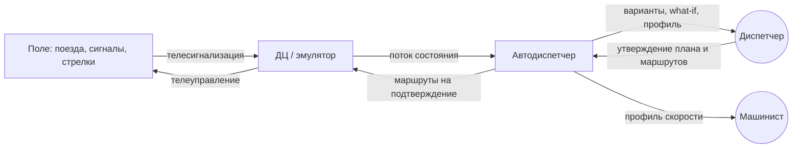
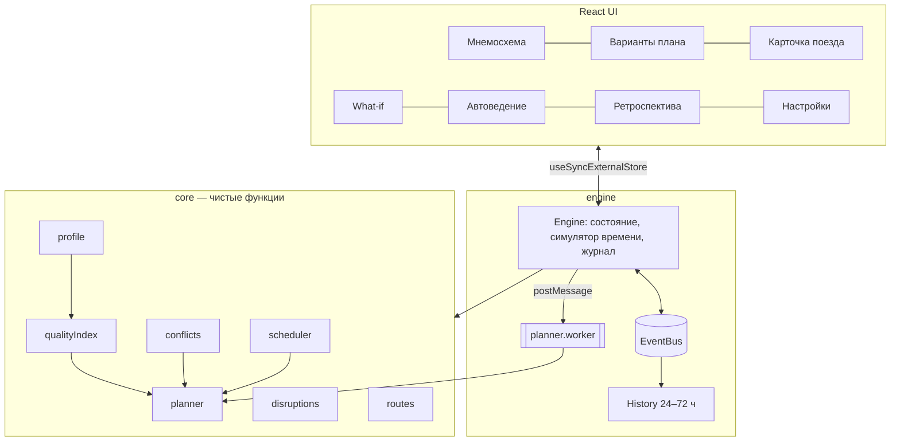
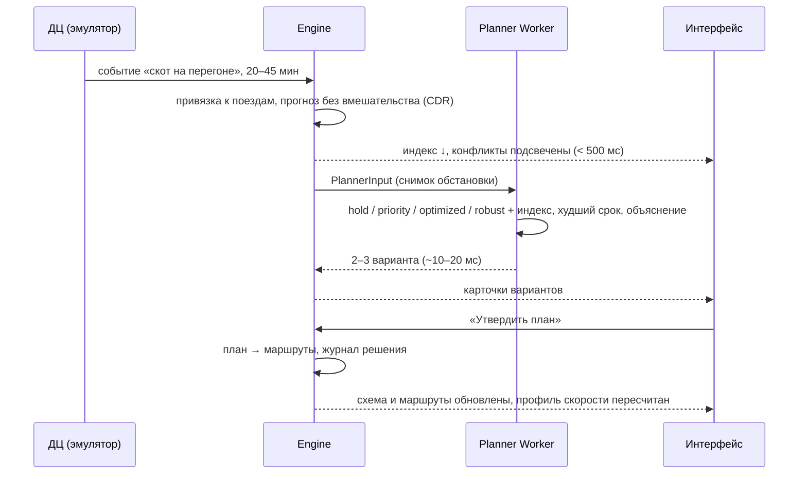

# Архитектура Автодиспетчера

## Место в контуре управления

Автодиспетчер не управляет полем напрямую: всё, что уходит в ДЦ, утверждает диспетчер (human-in-the-loop).
Единственное автоматическое действие — безопасный вариант «Ждать устранения», если решение не принято до первого конфликта,
и выставление маршрутов по уже утверждённому плану (отключается переключателем «Автоустановка маршрутов»).

## Модули

| Модуль | Ответственность |
|---|---|
| `core/scheduler` | построение бесконфликтного графика: резервирование перегонов и путей, заморозка прошлого, назначение путей |
| `core/planner` | стратегии (`hold`, `priority`, `optimized`, `robust`, `whatif`), оптимизатор очерёдности, варианты с объяснением |
| `core/conflicts` | обнаружение конфликтов (встречные, попутные, ёмкость), разбор скрещений и вынужденных стоянок |
| `core/qualityIndex` | индекс качества движения по пяти факторам с настраиваемыми весами |
| `core/profile` | автоведение: оптимальный режим «разгон — движение — накат — торможение» |
| `core/disruptions` | фиксация сбоя с диапазоном длительности, привязка к поездам |
| `core/routes` | преобразование плана в маршруты приёма/отправления и их статусы |
| `engine/engine` | оркестратор: эмулятор ДЦ, обработка событий, решения, what-if, маршруты, метрики |
| `engine/history` | кольцевой буфер снимков (шаг 5 с) для перемотки и отчётов |
| `engine/planner.worker` | расчёт вариантов вне основного потока |
| `engine/report` | CSV и печатная форма (PDF) |

## Поток при сбое

## Перенос на backend

`src/core` не зависит от браузера, а `Engine` общается с UI только через состояние и шину событий,
поэтому оба переносятся в Node-сервис без изменений:

- `POST /disruptions` → `engine.inject`, `PATCH /disruptions/{id}` → `refine` / `resolve`;
- `GET /plan`, `GET /variants`, `POST /variants/{id}/apply`;
- `POST /whatif` (моды песочницы) → прогноз;
- `GET /trains/{id}/profile`;
- `GET /history?from&to`, `GET /reports/{csv|pdf}`;
- WebSocket `/stream` — состояние участка и события шины.
